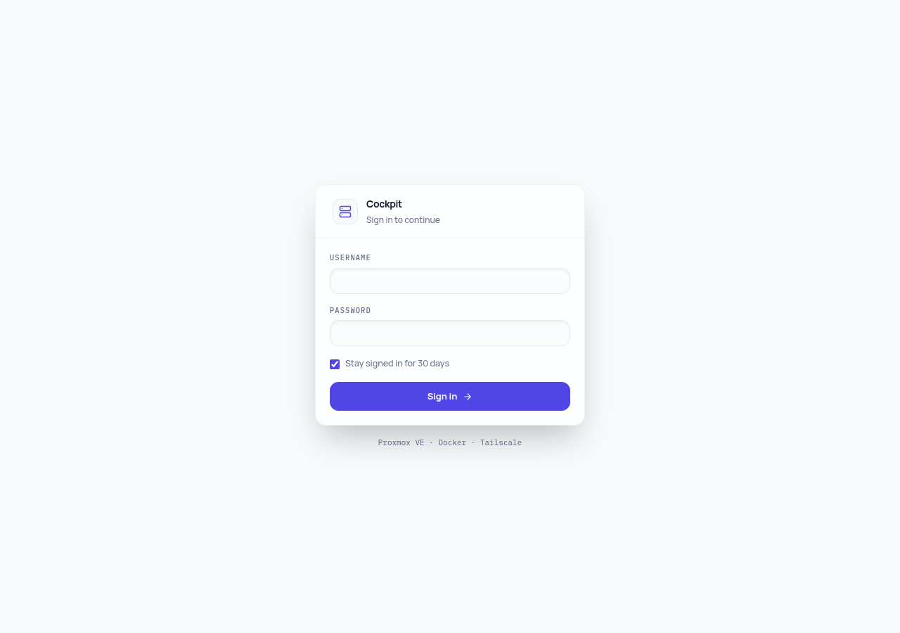
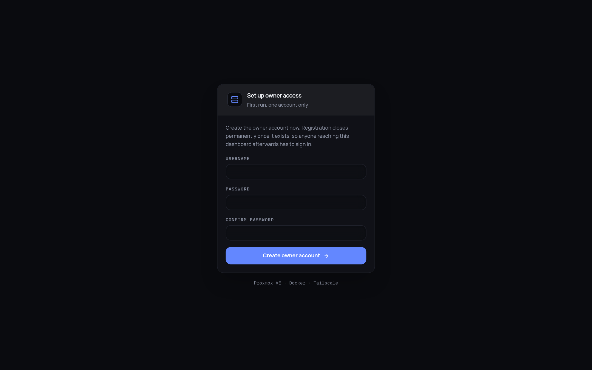

# Homelab Cockpit

A single-pane dashboard for a compact homelab: Proxmox VE host vitals, Docker container telemetry, Tailscale peers, storage and DAS mount health, SSL expiry, AI coding agent metrics, and an optional Telegram companion bot. One Node.js daemon, one React client, no external monitoring stack.

Built for a Lenovo ThinkCentre M710q Tiny running Proxmox VE with an Ubuntu LXC container runner and an external multi-bay DAS enclosure, but adaptable to any Linux-based homelab environment.


## Results in Production

Running on an unprivileged Ubuntu 24.04 LXC on the M710q under Proxmox VE 8, replacing a stack of separate monitoring tools:

| Metric | Before | After |
| --- | --- | --- |
| Monitoring containers | 6 across 4 tools | 1 daemon |
| LXC memory in use | high baseline pressure | 2.2 GB of 12 GB |
| NVMe reclaimed | -- | 15.27 GB |
| Browser tabs to operate | 4 | 1 |
| Poll loops | 4 independent | 1 multiplexed WebSocket |

Netdata, Uptime Kuma, Portainer, and legacy dashboards were decommissioned. Full write-up in [docs/case-study.md](docs/case-study.md).

## Web Design & Interface Preview

### 1. Legacy Overview Dashboard
The main command center providing instant homelab visibility: real-time CPU and memory telemetry, package temperatures, uptime, DAS mount health, quick startpage shortcuts, weather, and container status totals.


### 2. Experimental Brutalist UI (Beta)
We're currently experimenting with a secondary brutalist/constructivist dashboard layout option (available via the "Switch to Beta UI" button on the main overview block before you login vs inside depending on versions). It removes blur/glassmorphism entirely in favor of a strictly structured layout, mono fonts, and stark grid borders. 



### 3. Fleet Management
Real-time container inventory across all configured Docker hosts. Features sparkline history for CPU and memory, live per-second network transfer rates, L7 HTTP health probe verification, container logs, restarts, and custom public tunnel domain pins.


### 4. Infrastructure & Storage Watchdog
Comprehensive hardware metrics, Proxmox VE vzdump backup history, external DAS mount status with `.mounted` canary tracking, disk read/write throughput charts, disaster recovery backups, and safe layer pruning.



## Architecture

```text
Host machine (Proxmox + Ubuntu Runner)
│
├── System Sensors (lm-sensors, /proc, docker sock)
│
└── Node.js Fastify Daemon (homelab-cockpit server)
    ├── REST API (authenticated)
    ├── WebSocket (2-second multiplexed stream)
    └── Background Workers:
        ├── System Watchdog (L7 HTTP, Docker stats, NVMe)
        ├── GitHub commit tracking for tracked projects
        ├── rclone backup / restore, plus small-config import
        ├── SSH terminal bridge (no command whitelist)
        ├── AI agents telemetry (Claude Pro, Gemini / Antigravity)
        └── optional Telegram bot with Gemini Q&A
             │
        React client (Vite + Tailwind + React Router)
        ├── Overview / Fleet / Infra / Git / Processes / Sentinel / AI Agents
        ├── Ctrl+K command palette
        └── light and dark theme
```

## Features

**Owner authentication.** The first visit prompts to register a single owner account, after which registration closes permanently. Every `/api` route and the WebSocket require a bearer token; sessions can persist up to 30 days. Health and authentication status endpoints remain public.

**Host vitals.** Proxmox CPU, memory, package temperature, and uptime; LXC CPU, memory, and load average; fan speed and kernel throttle counters; vzdump backup status, archive size, and duration.

**Container fleet.** Live CPU, memory, and per-second network bandwidth for every container, with historical sparklines, sortable columns, filters, and pagination. L7 HTTP probes report the actual HTTP status code and response latency rather than relying solely on Docker's "Up" state. The Web UI link lets you select which address to open -- LAN, Tailscale, or assigned public domain.

**Multiple Docker hosts.** Point the daemon at multiple Docker daemons (via `DOCKER_HOSTS`) to aggregate containers into a unified fleet table, tagged and filterable by host. Host-level CPU and RAM telemetry remains scoped to the primary host running the daemon.

**Storage and DAS watchdog.** Disk usage tracking per volume along with a canary file check (`.mounted`) on external enclosures. If an external drive disconnects, an alert banner appears immediately to prevent containers from overflowing the root NVMe drive.

**Disk performance.** Infra page Performance tab: track real-time read/write throughput and disk activity percentages over time directly from `/proc/diskstats`, requiring no additional host agent.

**Processes.** Multi-tab system inspection covering host processes, Docker container processes (via `docker top`), and remote hosts via read-only SSH execution.

**Shortcuts & bookmarks.** Customizable startpage bookmarks grid on the Overview page with custom titles, URLs, and drag-and-drop reordering.

**Notifications.** Centralized notification dropdown logging container events, git project tracking, automated pull & rebuilds, and system alerts. Supports opt-in browser desktop notifications.

**Tailscale mesh.** Real-time peer list with online status, `100.x` IP addresses, MagicDNS hostnames, exit nodes, and subnet routes.

**SSL certificate tracker.** Expiration countdown for Let's Encrypt certificates provisioned through Nginx Proxy Manager, highlighting certificates expiring within 30 and 14 days.

**Disk hygiene.** Detection of reclaimable disk space across dangling Docker images and build cache, paired with a safe prune action. Running containers and named volumes are protected.

**Backup, restore, and config import.** Scheduled or on-demand disaster recovery using `rclone sync` to configured cloud storage (Nextcloud, Google Drive, etc.). Also supports importing lightweight configs (`pins.json`, `git-projects.json`) directly from public links or archives without modifying owner credentials.

**Git project deployment.** Track containers built from source against GitHub repositories. Check for incoming commits, inspect diffs for potential database migration risks, and trigger automated pull and rebuild commands (`docker compose up -d --build`).

**Pinned containers & public tunnels.** Pin key containers with custom public domains (e.g. Cloudflare tunnels), persisted across client sessions in `data/pins.json`.

**AI Agents monitoring.** Live telemetry tracking AI coding assistants (Claude Pro, Gemini / Antigravity via T3 Code), including 5-hour rolling token windows, cooldown counters, and weekly activity distribution charts.

**In-app self-update.** Direct version check against the GitHub repository with one-click background update and auto-reload capabilities.

**Terminal.** Integrated interactive terminal in the browser using xterm.js connecting via SSH key authentication to Proxmox VE or Docker hosts defined in `SSH_TARGETS`.

**Sentinel companion (optional).** Embedded Telegram bot offering multi-tier homelab management: read-only telemetry, Gemini-powered query assistant, and whitelisted container restarts/prunes with confirmation safeguards.

**Privacy mode & kiosk mode.** Quickly redact IP addresses and internal domains with one click before taking screenshots or sharing views; fullscreen kiosk mode suited for homelab wall monitors.

## Quick Start

```bash
git clone https://github.com/srytmj/homelab-dashboard.git
cd homelab-dashboard
cp .env.example .env
npm install
docker compose up -d --build
```

The dashboard will be available at `http://<docker-host>:8050`.

Without a configured `.env`, the daemon starts in demo mode with simulated telemetry, ideal for local testing and development.

### Setup Checklist

- **`STORAGE_MOUNTS`**: Must be existing paths on the machine hosting the daemon. Non-existent paths fall back to simulated values.
- **`STORAGE_LABELS`**: Optional comma-separated display names matching the order of `STORAGE_MOUNTS`.
- **`DOCKER_SOCKET` / `DOCKER_HOST_NAME`**: Match the environment where the daemon executes. Set `DOCKER_HOSTS` only if aggregating multiple Docker nodes.
- **`PROXMOX_URL`, `PROXMOX_TOKEN_ID`, `PROXMOX_TOKEN_SECRET`**: Required for live Proxmox hypervisor metrics. Without them, the dashboard displays demo data with a `SIMULATED` indicator.
- **Container Public Domains**: Provide complete URLs (e.g., `https://jellyfin.yourdomain.com`) when pinning services exposed through reverse proxies or tunnels.

## Local Development

```bash
npm install          # Install dependencies and git hooks
npm run dev:server   # Run Fastify daemon with tsx watch on :3000
npm run dev:client   # Run Vite development server on :5173
```

To create a production build:

```bash
npm run build        # Builds both client (Vite) and server (TypeScript)
npm start            # Serves production client directly from the Fastify server
```

Commit messages follow [conventional commits](https://www.conventionalcommits.org) enforced through husky and commitlint.

## HTTP API

All endpoints except `/api/health` and `/api/auth/*` require authentication via `Authorization: Bearer <token>`. The WebSocket accepts the token via query parameter (`/ws?token=<token>`).

| Method | Path | Purpose |
| --- | --- | --- |
| GET | `/api/health` | Liveness check |
| GET | `/api/auth/status` | Verify owner existence and token validity |
| POST | `/api/auth/register` | Initialize owner credentials (one-time) |
| POST | `/api/auth/login` | Authenticate and obtain session token |
| POST | `/api/auth/logout` | Terminate session token |
| GET | `/api/snapshot` | Homelab telemetry snapshot |
| GET | `/api/tailscale` | Tailscale mesh status and peers |
| GET | `/api/ssl` | SSL certificate expiry data |
| GET | `/api/sentinel` | Telegram companion status |
| GET | `/api/containers/:id/logs?tail=100` | Fetch container stdout/stderr logs |
| POST | `/api/containers/:id/restart` | Trigger container restart |
| POST | `/api/docker/prune` | Safe prune of dangling layers and build cache |
| POST | `/api/pins/:name` | Pin container with optional public domain |
| DELETE | `/api/pins/:name` | Remove container pin |
| GET | `/api/bookmarks` | Fetch custom startpage bookmarks |
| POST | `/api/bookmarks` | Create bookmark |
| PUT | `/api/bookmarks/reorder` | Reorder bookmarks array |
| PUT | `/api/bookmarks/:id` | Update bookmark |
| DELETE | `/api/bookmarks/:id` | Remove bookmark |
| POST | `/api/git-projects/:containerName` | Track Git repository for container |
| DELETE | `/api/git-projects/:containerName` | Stop tracking Git repository |
| POST | `/api/git-projects/:containerName/check-pull` | Dry-run git diff checking migration risks |
| POST | `/api/git-projects/:containerName/pull` | Execute git pull and container rebuild |
| GET | `/api/ai-agents/telemetry` | AI coding agents quota and usage telemetry |
| GET | `/api/app-update/status` | Check local vs upstream Git version |
| POST | `/api/app-update/check` | Fetch upstream Git commit updates |
| POST | `/api/app-update/update` | Execute automated self-update |
| GET | `/api/processes` | List primary host processes |
| GET | `/api/processes/docker` | List running container processes |
| GET | `/api/processes/remote/:target` | List processes on remote SSH target |
| GET | `/api/backup/status` | Last backup/restore status and paths |
| POST | `/api/backup/run` | Trigger immediate rclone backup |
| POST | `/api/backup/restore` | Restore homelab data from remote target |
| POST | `/api/backup/import-config` | Import pins and git configs from archive URL |
| GET | `/api/ssh-targets` | List configured SSH target identifiers |
| WS | `/ws` | Live snapshot feed broadcast every 2s |
| WS | `/ws/terminal?target=<name>` | Interactive SSH terminal session |

## Documentation

- [User Manual](docs/USER_MANUAL.md) - In-depth guide for interface controls and configuration.
- [Design System](docs/DESIGN_SYSTEM.md) - Color palette, typography, and component specifications.
- [CLAUDE.md](CLAUDE.md) - Architecture guidelines and development briefing for AI agents.

## License

MIT License.
